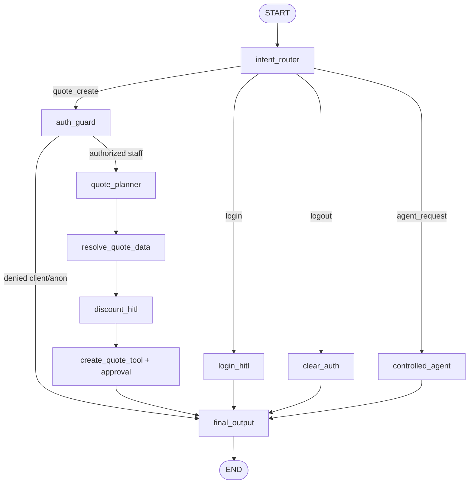

# Technical Design — Smart Quote Agent Example

## Architectural Overview & Topology

The Smart Quote Agent is implemented as an autonomous CLI application inside `examples/smart_quote_agent/`. It relies upon Proteo Runtime's core contracts, LangGraph node integration (`RuntimeNode`), host-managed tools (`proteo_runtime.tools`), and metadata-only observability (`proteo_runtime.observability`).

```text
examples/smart_quote_agent/
├── README.md               # User guide, credentials, transcripts, security disclaimer
├── app.py                  # CLI loop, runtime lifecycle, graph runner, exit handling
├── init_demo.py            # SQLite reset and seed script (--reset)
├── database.py             # Schema creation, queries, transactional quote persistence, currency
├── models.py               # Pydantic schemas (router, planner) and graph state types
├── auth.py                 # Masked login, credential validation, sanitized identity, policy map
├── tools.py                # Host tools (@runtime_tool), registry factory, executor factory
├── graph.py                # LangGraph StateGraph, router, quote workflow, controlled agent
├── hitl.py                 # Interactive discount prompt and Phase 5 ApprovalHandler
└── data/
    └── .gitkeep            # Data folder placeholder for demo.sqlite3
```

## Module Specifications

### 1. `database.py`

Manages database connections, schema provisioning, queries, and transactional writes using standard library `sqlite3`.

```python
def get_db_path() -> Path:
    """Return the absolute path to the demo SQLite database."""

def get_connection(db_path: Path | None = None) -> sqlite3.Connection:
    """Create a connection with PRAGMA foreign_keys = ON and Row row_factory."""

def init_database(db_path: Path | None = None, *, reset: bool = False) -> None:
    """Initialize SQLite schema, dropping existing tables if reset is True."""

def seed_database(db_path: Path | None = None) -> None:
    """Insert default customers, users, and product catalog records."""

def find_customer_by_query(conn: sqlite3.Connection, query: str) -> dict[str, Any] | None:
    """Search customers table by exact ID, code, or name match."""

def list_active_products(conn: sqlite3.Connection) -> list[dict[str, Any]]:
    """Return all active products ordered by SKU."""

def find_product_by_query(conn: sqlite3.Connection, query: str) -> dict[str, Any] | None:
    """Search products table by exact SKU, ID, or substring match."""

def get_quote_by_id(conn: sqlite3.Connection, quote_id: int) -> dict[str, Any] | None:
    """Fetch quote header and line items by quote ID."""

def list_recent_quotes(conn: sqlite3.Connection, limit: int = 10) -> list[dict[str, Any]]:
    """List recent quotes ordered by creation time descending."""

def persist_quote_transactional(
    conn: sqlite3.Connection,
    *,
    customer_id: int,
    created_by_user_id: int,
    lines: list[tuple[int, int, int]],  # (product_id, quantity, unit_price_cents)
    discount_percent: int,
) -> int:
    """Atomically insert quote header and lines within a single transaction."""
```

#### Monetary and Currency Calculation Helpers

```python
def cents_to_decimal(cents: int) -> Decimal:
    """Convert integer cents to Decimal dollars."""
    return Decimal(cents) / Decimal(100)

def calculate_discount_amount(subtotal_cents: int, discount_percent: int) -> int:
    """Compute discount amount in integer cents using ROUND_HALF_UP."""
    subtotal = Decimal(subtotal_cents)
    pct = Decimal(discount_percent)
    amount = (subtotal * pct / Decimal(100)).quantize(Decimal("1"), rounding=ROUND_HALF_UP)
    return int(amount)

def format_currency(cents: int) -> str:
    """Format integer cents as USD string, e.g. $1,200.00."""
```

### 2. `models.py`

Defines structured Pydantic schemas for LLM routing and planning, alongside LangGraph state definitions.

```python
class IntentDecision(BaseModel):
    """Structured classifier output for top-level user intent."""
    intent: Literal["login", "logout", "quote_create", "agent_request"]
    reasoning: str = ""

class RequestedItem(BaseModel):
    """Product quantity pair requested by the user."""
    product: str
    quantity: int = Field(gt=0, description="Quantity must be at least 1")

class QuoteRequest(BaseModel):
    """Extracted quote creation request parameters."""
    customer: str = Field(min_length=1, description="Customer name or code")
    items: list[RequestedItem] = Field(min_length=1, description="At least one item required")

@dataclass(frozen=True, slots=True)
class AuthenticatedUser:
    """Sanitized user identity stored in host state."""
    user_id: int
    username: str
    display_name: str
    role: Literal["staff", "client"]
    customer_id: int | None

class QuoteLineDraft(TypedDict):
    """Draft quote line with authoritative prices from DB."""
    product_id: int
    sku: str
    name: str
    quantity: int
    unit_price_cents: int
    subtotal_cents: int

class QuoteDraft(TypedDict):
    """Authoritative quote draft calculated host-side."""
    customer_id: int
    customer_name: str
    lines: list[QuoteLineDraft]
    subtotal_cents: int
    discount_percent: int
    discount_amount_cents: int
    total_cents: int

class DemoState(TypedDict, total=False):
    """Host-owned LangGraph state."""
    input: str
    output: str
    authenticated_user: AuthenticatedUser | None
    intent: str
    quote_request: QuoteRequest | None
    quote_draft: QuoteDraft | None
    created_quote_id: int | None
```

### 3. `auth.py`

Encapsulates password masking, credential validation against SQLite, sanitized identity generation, and role-to-policy mapping.

```python
def authenticate_user_interactive(conn: sqlite3.Connection) -> AuthenticatedUser | None:
    """Prompt user for username and masked password (via getpass), validating in SQLite.

    The password variable is deleted immediately after check and never returned.
    """

def get_permission_policy_for_user(user: AuthenticatedUser | None) -> ToolPermissionPolicy:
    """Return the authoritative ToolPermissionPolicy matching the user's role."""
    if user is not None and user.role == "staff":
        return ToolPermissionPolicy(
            frozenset({
                "catalog.read",
                "quote.calculate",
                "customer.read",
                "quote.create",
                "quote.read",
            })
        )
    return ToolPermissionPolicy(
        frozenset({
            "catalog.read",
            "quote.calculate",
        })
    )
```

### 4. `tools.py`

Defines all seven host-managed tools using `@runtime_tool`, the registry factory, and the executor factory with approval configuration.

```python
def create_tool_registry(conn: sqlite3.Connection) -> ToolRegistry:
    """Instantiate and populate a ToolRegistry with all 7 host-managed tools."""

def create_tool_executor(
    registry: ToolRegistry,
    user: AuthenticatedUser | None,
    approval_handler: ApprovalHandler | None = None,
) -> ToolExecutor:
    """Build a ToolExecutor bound with the user's role policy and approval handler."""
```

#### Tool Definitions:
- `list_products()`: reads active products from SQLite.
- `find_product(query: str)`: matches product by SKU or name.
- `calculate_quote(items: list[dict[str, int]])`: re-reads authoritative prices, computes line subtotals and sum subtotal.
- `find_customer(query: str)`: matches customer by code or name (staff only).
- `create_quote(customer_id: int, items: list[dict[str, int]], discount_percent: int)`: requires write side-effect approval; executes `persist_quote_transactional`.
- `list_quotes(limit: int = 10)`: returns newest quotes (staff only).
- `get_quote(quote_id: int)`: returns full quote detail with lines (staff only).

### 5. `hitl.py`

Contains the interactive human-in-the-loop handlers for discount input and tool persistence approval.

```python
def prompt_discount_interactive(subtotal_cents: int) -> int:
    """Prompt the user for a discount percentage (0..30) in the CLI.

    Defaults to 0 on empty input; rejects and re-prompts invalid numbers.
    """

class ConsoleApprovalHandler(ApprovalHandler):
    """Phase 5 ApprovalHandler prompting the user interactively on stdout/stdin."""

    async def request_approval(self, request: ApprovalRequest) -> ApprovalDecision:
        """Render action details and ask for explicit [y/N] confirmation."""
```

### 6. `graph.py`

Compiles the LangGraph `StateGraph` combining the deterministic quote workflow with the controlled agent branch.



#### Node Responsibilities:
- `intent_router`: calls structured model with `IntentDecision` schema.
- `login_hitl`: executes `authenticate_user_interactive` and assigns `authenticated_user`.
- `clear_auth`: clears `authenticated_user` to `None`.
- `auth_guard`: checks `authenticated_user.role == "staff"`. If not, sets error output and routes to `final_output`.
- `quote_planner`: calls structured model with `QuoteRequest` schema to extract customer name and items.
- `resolve_quote_data`: resolves customer ID, product IDs, and re-reads DB prices to build `QuoteDraft`.
- `discount_hitl`: prompts user for discount (0–30%) and calculates `discount_amount_cents` and `total_cents`.
- `create_quote_tool`: invokes `create_quote` tool via `ToolExecutor` (triggering `ConsoleApprovalHandler` for final confirmation).
- `controlled_agent`: executes `RuntimeModel.with_tools(registry, executor)` on catalog/quote read inquiries.
- `final_output`: formats presentation message for the CLI.

### 7. `app.py`

Interactive CLI entrypoint:
- Checks if database exists; suggests running `init_demo.py --reset` if missing.
- Sets up `ObservabilityConfig` with `PayloadMode.METADATA_ONLY`.
- Runs async event loop for interactive user interaction.
- Intercepts `exit` / `quit` commands deterministically.
- Passes input to compiled graph, preserves `authenticated_user` between loop iterations, and prints formatted output.

## Security and Invariant Summary

| Security Boundary | Demonstrated Mechanism |
|---|---|
| Credential Masking | `getpass.getpass()` suppresses echo; password discarded immediately. |
| Zero Credential Leakage | Passwords never placed into graph state, inputs, events, or logs. |
| Dual-Layer Authorization | LangGraph `auth_guard` + host `ToolPermissionPolicy` in `ToolExecutor`. |
| Pricing Authority | Model monetary values ignored; DB prices and Decimal arithmetic enforced. |
| Discount Guard | Hard limit `0..30%` validated host-side; defaults to `0%`. |
| Transactional Integrity | SQLite atomic transaction (`BEGIN ... COMMIT`) with rollback on denial. |
| Controlled Agent Sandboxing | Tools strictly bounded to catalog/read; no OS, shell, or raw SQL access. |
| Observability Safety | `PayloadMode.METADATA_ONLY` prevents telemetry data leakage. |

## Conversational Hardening Addendum (Authoritative for SQA-REQ-014–018)

This addendum supersedes any earlier one-shot quote-state descriptions above. The model may propose an intent or patch; the host reducer and database remain authoritative.

### Host-Owned Quote Workflow

`DemoState.quote_workflow` is a `QuoteWorkflowState` with a generated `workflow_id`, monotonic `revision`, phase, customer query and canonical resolution, stable line IDs, product query/canonical resolution, quantity, per-line status/candidates, focus, and the last candidate set shown. `pending_quote_request` is only a compatibility projection. `quote_draft` is disposable and carries the exact workflow ID/revision from which host prices were calculated.

The pure host reducer applies `QuotePatch` operations (`set_customer`, `add_item`, `replace_item`, `set_quantity`, `remove_item`) against stable line IDs. It preserves unrelated lines and quantity during replacement. A short answer can target a missing field only if there is exactly one compatible line; otherwise the graph returns clarification without changing quote data or revision. Deictic references require one candidate/reference stored by the host.

Resolver behavior is all-lines, not fail-fast: it keeps valid lines, reports every invalid or incomplete line and candidate, re-reads active SQLite prices, and produces a revision-bound draft only after all required values resolve. Discount review and persistence both check workflow ID/revision. Terminal cancellation, logout, identity switch, approval denial, success, and persistence failure clear every pending quote reference.

### Contextual Router and Read-Only Task

Deterministic cancel/logout and explicit read-only intents precede pending-quote edits. Catalog, customer directory, help, and quote-history requests may be answered while a quote is pending; the host preserves the workflow and appends a localized reminder naming the next missing detail. Ambiguous input does not become a generic quote-create extraction.

The `RuntimeTask` remains one task per identity and receives only read-only conversational turns under `ContextPolicy.RUNTIME`. Its provider memory covers only turns sent to that task; it neither owns quote state nor receives host-side history replay. Host language state is stable across terse follow-ups.

### Entity Resolution and Customer Directory

The staff conversational registry contains `list_customers` (`customer.read`, bounded to 50, fields `id`, `code`, `name`) and `find_customer`. Customer and product matching normalizes case and accents. Resolution prefers exact ID/SKU/code, exact normalized name, safe alias, then a unique partial match. Multiple matches return explicit candidates. `mouse`, `mice`, and `mouses` may resolve to Wireless Mouse; `desk` never implies `dock` without an explicit correction.

### Metadata-Only Transition Observability

The local neutral `runtime_events` table gains nullable `task_id` through an additive, idempotent migration. Host transitions are stored with correlation IDs, workflow revision, intent, route, phase-before/after, and stable result code only; prompts, responses, and sensitive arguments are excluded. The inspector can render `--task` and `--workflow` timelines and surfaces provider diagnostics such as `task.cleanup.provider_delete_failed`. OTel metrics displayed alongside a selected invocation remain explicitly labeled database-cumulative rather than invocation-scoped. Provider cleanup implementation remains outside the example boundary.

## Correlated Turn Error Diagnostics (Authoritative for SQA-REQ-019)

`app.py::_run_repl_loop` creates a fresh random `interaction_id` before calling `app_graph.ainvoke`. `graph.py` preserves that ID for direct-test compatibility and passes it to each structured `RuntimeModel.ainvoke` and controlled `RuntimeTask.ainvoke` as `InvocationConfig.metadata`, alongside a fixed stage label and task/workflow IDs when available. The runtime API is consumed as-is; no `src/` change is allowed.

The REPL error boundary records a best-effort `host.turn_error` via `ObservabilityManager.record_host_error`. Structured calls annotate a raised exception with a fixed stage label and re-raise it unchanged. Persistence errors that are intentionally converted to a host response are logged at `create_quote_tool` before the graph handles the terminal result. The diagnostic encoder reads no exception message or locals; it records exception module/type, a code only when it matches a bounded machine-code pattern, cause type names (maximum eight), and at most forty traceback frames. In-repository paths are repository-relative; external paths contain only a basename. Both the REPL and `record_host_error` isolate logger failures.

The telemetry schema adds nullable `interaction_id` to `runtime_events`, indexed by `idx_runtime_events_interaction`. Migration checks column existence before `ALTER TABLE`, preserving existing rows. Runtime events extract interaction correlation from safe invocation metadata; host transitions/errors use the same column and retain only explicit metadata allow-lists.

The read-only `--interaction` inspector queries the new column and renders a merged chronological event timeline plus a curated error summary. A host error overrides only the derived interaction view to `failed`; it does not mutate the original runtime event stream or invocation status rows. Successful interactions with terminal runtime completion remain `completed`. The diagnostic view never renders arbitrary metadata fields.

Live validation compares a read-only quote count immediately before and after execution. The quote write is approved only if customer, canonical SKUs, quantities, discount, and total match the acceptance condition. Provider failures are captured and reported without retrying persistence or resetting either database.
