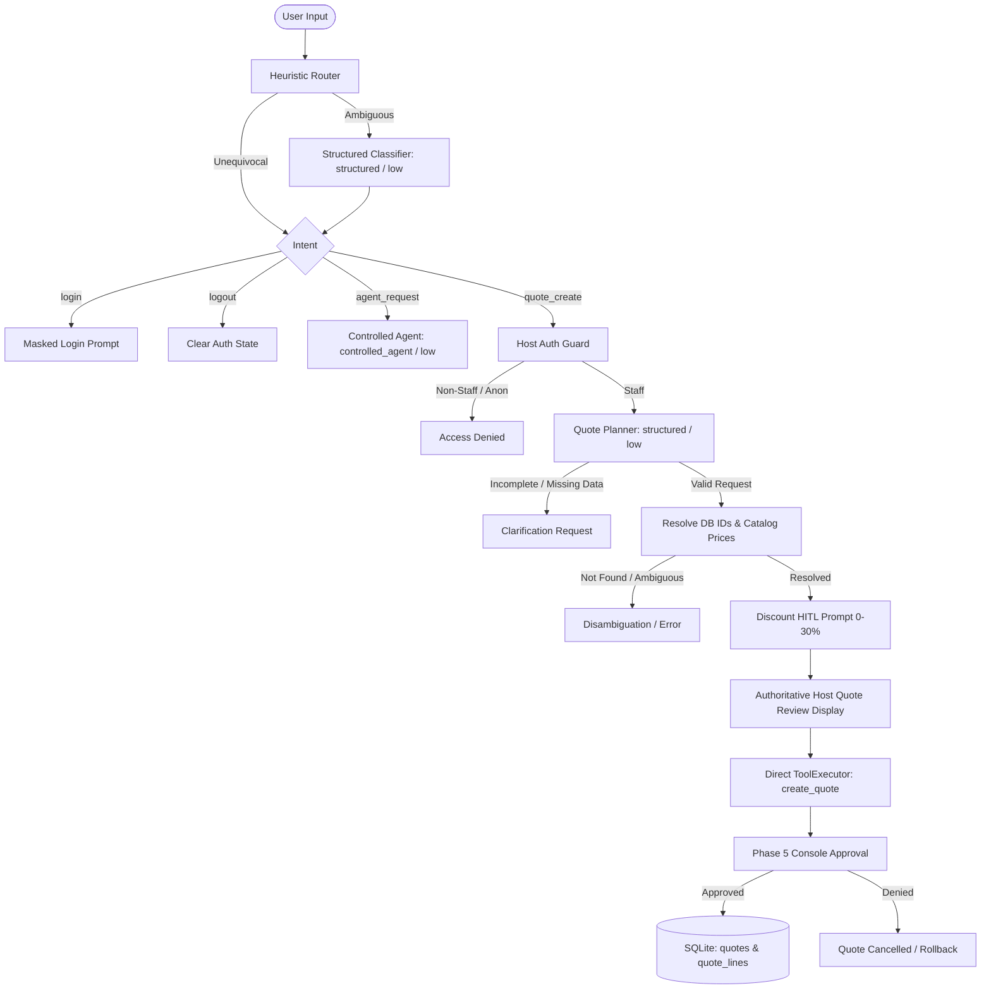

# Smart Quote Agent — CLI Demo

A complete, self-contained demonstration of **Proteo Runtime** showcasing LangGraph workflow orchestration, structured routing and parameter extraction, host-managed dynamic tools, strict tool segregation, dual-layer authorization, human-in-the-loop (HITL) confirmation, masked password authentication, authoritative integer-cent pricing, and atomic SQLite persistence.

---

## 1. Core Principles & Architecture

> **"The model may decide what it wants to do. The host decides what it is allowed to do and what is actually executed."**

The application is deliberately partitioned into two operational spheres:

- **Controlled Conversational Agent**: Handles open-ended natural language inquiries (such as product catalog lookup, item specifications, calculation previews, and general assistant guidance) using host-managed tools. Under **no circumstances** does this agent receive the `create_quote` tool.
- **Deterministic State Workflow**: Governs privileged mutations (quote planning, host completeness validation, customer resolution, discount selection via HITL, dual-layer authorization checks, human write confirmation, and atomic SQLite persistence).



---

## 2. Dual Model Bindings & Runtime Capabilities

The demo requires and establishes two distinct model bindings, each configured explicitly at logical level `"low"`:

1. **`structured_model`** (`profile="structured"`, `level="low"`):
   - Used for deterministic JSON schema outputs (`IntentDecision` and `QuoteRequest`).
   - Does not bind tools; operates with structured output policies and strict schema validation (`extra="forbid"`).
   - Instructed to extract only information explicitly stated and never invent or guess missing customer names, products, or quantities.
2. **`controlled_agent_model`** (`profile="controlled_agent"`, `level="low"`):
   - Used for conversational tool use and general assistant inquiries.
   - Bound with host-managed tools via `.with_tools(agent_registry, executor=executor)`.
   - Never exposed to `create_quote`.

### Experimental Dynamic Tools Flag
When instantiating `CodexRuntime`, the runtime must be initialized with:
```python
runtime = CodexRuntime(experimental_dynamic_tools=True)
```
`experimental_dynamic_tools=True` is required when binding host-managed tools to the `controlled_agent` profile. If disabled, `CodexRuntime` fails closed with `CapabilityError`.

### Clean Model Parameters
The legacy single `model` parameter has been completely removed from `create_demo_graph`. Both `structured_model` and `controlled_agent_model` are explicit, independent parameters (defaulting to `None` for offline deterministic execution).

---

## 3. Tool Registry Segregation & Dual-Layer Authorization

The architecture enforces strict asymmetric tool distribution and dual-layer authorization:

### Tool Registries
- **Conversational Agent Registry** (`get_agent_tool_registry`):
  - Anonymous & Client: `list_products`, `find_product`, `calculate_quote`.
  - Staff: `list_products`, `find_product`, `calculate_quote`, `find_customer`, `list_quotes`, `get_quote`.
  - **Absolute Segregation**: `create_quote` is **never** registered in the conversational agent's registry. Persistent quote mutation is entirely unreachable from conversational turns.
- **Dedicated Write Registry** (`get_quote_write_registry`):
  - Contains exclusively `create_quote`, bound specifically to the authenticated staff user.
  - Used only by `create_quote_tool_node` within the deterministic quote creation branch after approval.

### Dual-Layer Authorization
1. **Host Graph Guard** (`auth_guard_node`): Intercepts the request before any quote planning or database resolution takes place. Non-staff callers receive an immediate authorization denial.
2. **ToolPermissionPolicy**: Enforces fine-grained capability allow-lists inside `ToolExecutor` (`catalog.read`, `quote.calculate`, `customer.read`, `quote.create`, `quote.read`).

---

## 4. Host-Side Validation & Data Integrity

### Strict Schema Extraction & Validation
The Pydantic schemas in `models.py` guarantee that missing request data cannot be hallucinated into valid drafts:
- `RequestedItem`: `product: str | None = None`, `quantity: int | None = Field(default=None, gt=0)`
- `QuoteRequest`: `customer: str | None = None`, `items: list[RequestedItem] = Field(default_factory=list)`

Host-side validation requires:
- `customer` must be non-empty;
- at least one item must be present;
- each item must have a valid `product` name and `quantity > 0`.

If information is missing, the workflow halts immediately with a clarification request and does not proceed to database resolution or HITL.

### Disambiguation & SQL Wildcard Escaping
- In `database.py`, `_escape_like` escapes `%` and `_` characters in queries.
- If a search query matches multiple customers or products, `find_customer_by_query` and `find_product_by_query` return an explicit `ambiguous: True` result with candidate matches, preventing arbitrary selection.

### Authoritative Price & Math Integrity
- The model is **never** trusted for pricing numbers or arithmetic calculations.
- Product unit prices are re-read directly from the SQLite `products` table in integer cents.
- Line subtotals, discount amounts, and totals are computed using whole-cent integer arithmetic and `ROUND_HALF_UP` rounding.

### Transactional SQLite Persistence
- Quote creation executes under `BEGIN IMMEDIATE TRANSACTION;` with `PRAGMA foreign_keys = ON;`.
- Inserts the `quotes` header and all `quote_lines` atomically.
- Automatically rolls back on any error or if human approval is denied.

---

## 5. Directory Layout

All application code, data, tests, and documentation are strictly contained within `examples/smart_quote_agent/`:

```text
examples/smart_quote_agent/
├── README.md               # Documentation and architectural guide (this file)
├── app.py                  # Interactive CLI application and unified REPL loop
├── auth.py                 # Masked authentication, sanitized identity, and role policies
├── database.py             # Schema DDL, search helpers, and atomic persistence
├── graph.py                # LangGraph StateGraph compiling hybrid deterministic/agent workflow
├── hitl.py                 # Discount prompt and Phase 5 ConsoleApprovalHandler
├── init_demo.py            # SQLite schema provisioning and seed script
├── models.py               # Pydantic schemas, TypedDict state, and inputs
├── data/
│   └── .gitkeep            # Local placeholder for demo.sqlite3
└── tests/
    ├── __init__.py         # Test package initialization
    └── test_agent.py       # 24-point audit and hardening regression test suite
```

---

## 6. Demo Credentials & Access Matrix

All demo accounts use the trivial password `1234` for ease of local testing:

| Username | Password | Role | Customer Associated | Permissions | Conversational Tools Available |
|---|---|---|---|---|---|
| `staff` | `1234` | `staff` | *None* | `catalog.read`, `quote.calculate`, `customer.read`, `quote.create`, `quote.read` | `list_products`, `find_product`, `calculate_quote`, `find_customer`, `list_quotes`, `get_quote` |
| `client1` | `1234` | `client` | Acme Corp. (`1`) | `catalog.read`, `quote.calculate` | `list_products`, `find_product`, `calculate_quote` |
| `client2` | `1234` | `client` | Globex LLC (`2`) | `catalog.read`, `quote.calculate` | `list_products`, `find_product`, `calculate_quote` |
| `client3` | `1234` | `client` | Initech (`3`) | `catalog.read`, `quote.calculate` | `list_products`, `find_product`, `calculate_quote` |
| `client4` | `1234` | `client` | Northwind Traders (`4`) | `catalog.read`, `quote.calculate` | `list_products`, `find_product`, `calculate_quote` |
| *Anonymous* | — | *None* | *None* | `catalog.read`, `quote.calculate` | `list_products`, `find_product`, `calculate_quote` |

> [!WARNING]
> **Demo Security Disclaimer**: Authentication in this example is intended exclusively for demonstrating host-managed authorization and HITL workflows. It does not use salted password hashing, JWT tokens, or production IAM infrastructure.

---

## 7. Setup & Initialization

Ensure dependencies are installed using `uv`:

```bash
# Initialize or reset the local SQLite database with demo products, users, and customers
uv run python examples/smart_quote_agent/init_demo.py --reset
```

Output:
```text
Smart Quote Agent demo initialized.

Database:
.../examples/smart_quote_agent/data/demo.sqlite3

Users:
staff   / 1234
client1 / 1234
client2 / 1234
client3 / 1234
client4 / 1234
```

---

## 8. Running the Application

### Live Mode (Requires Codex / Provider Credentials)
```bash
uv run python examples/smart_quote_agent/app.py
```

### Offline Deterministic Mode (Provider-Free / Zero-Quota)
For automated verification, testing, or environments without live API credentials, pass `--offline`:
```bash
uv run python examples/smart_quote_agent/app.py --offline
```

### Running the Test Suite
The complete 24-point audit and hardening test suite runs deterministically with zero quota consumption:
```bash
uv run pytest examples/smart_quote_agent/tests
```

---

## 9. Interactive Scenarios & Transcripts

### Scenario A: General Capabilities & Assistant Guidance
```text
> Que puedo hacer con este agente?

Soy el asistente Smart Quote. Puedo ayudarte con:
1. Consultar el catálogo de productos y especificaciones disponibles.
2. Calcular subtotales y presupuestos preliminares sin compromiso.
3. Si eres personal de ventas (staff), registrar cotizaciones formales con descuentos y persistencia en base de datos.
4. Revisar el historial de cotizaciones recientes emitidas para clientes.

Para comenzar, puedes escribir 'productos' o iniciar sesión con 'login'.
```

### Scenario B: Anonymous Catalog Exploration & Authorization Denied
```text
> What notebooks do you have?

Available products:
- Notebook Air (NB-AIR): $900.00
- Notebook Pro (NB-PRO): $1,200.00
- Wireless Mouse (MS-WL): $40.00
- Mechanical Keyboard (KB-MECH): $85.00
- 27" Monitor (MON-27): $320.00
- USB-C Dock (DOCK-USBC): $150.00

> Create a quote for Globex for 2 Notebook Pro.

Access denied. Persisted quotes can only be created by staff.
```

### Scenario C: Client Login & Authorization Denied
```text
> login
Username: client2
Password: [MASKED]
Logged in as Client 2 (client)

[client2] > Create a quote for Globex for 2 Notebook Pro.

Access denied. Persisted quotes can only be created by staff.

[client2] > logout
Logged out. Continuing as anonymous.
```

### Scenario D: Incomplete Quote Request (Clarification Safeguard)
```text
[staff] > Create a quote for Globex

Could not extract complete quote details. Please specify both the customer name and items with quantities (e.g. 'Create a quote for Globex for 2 Notebook Pro').
```

### Scenario E: Ambiguous Search Query (Disambiguation Safeguard)
```text
[staff] > Create a quote for Globex for 2 Notebook

Multiple products matched 'Notebook': Notebook Pro (NB-PRO), Notebook Air (NB-AIR). Please specify exact SKU or name.
```

### Scenario F: Staff Login, Discount HITL, Host Quote Review & Approved Creation
```text
> login
Username: staff
Password: [MASKED]
Logged in as Demo Staff (staff)

[staff] > Create a quote for Globex for 3 Notebook Pro and 5 Wireless Mouse.

Subtotal: $3,800.00
Apply discount? [y/N]: y
Discount percentage [0-30, default 0]: 10

==================================================
HOST QUOTE REVIEW
==================================================
Customer: Globex LLC (ID: 2)
Line items:
  - Notebook Pro (NB-PRO): 3x @ $1,200.00 = $3,600.00
  - Wireless Mouse (MS-WL): 5x @ $40.00 = $200.00
Subtotal:        $3,800.00
Discount:        10% ($380.00)
Total:           $3,420.00
==================================================

[APPROVAL REQUIRED] Tool execution requested: create_quote
Customer ID: 2
Discount: 10%

Approve quote creation? [y/N]: y
[APPROVED] Action approved.

[SUCCESS] Quote #1 created for Globex LLC.
Total: $3,420.00
```

### Scenario G: Staff Quote Creation Denied at Final Approval
```text
[staff] > Create a quote for Globex for 1 Notebook Air.

Subtotal: $900.00
Apply discount? [y/N]: n

==================================================
HOST QUOTE REVIEW
==================================================
Customer: Globex LLC (ID: 2)
Line items:
  - Notebook Air (NB-AIR): 1x @ $900.00 = $900.00
Subtotal:        $900.00
Discount:        0% ($0.00)
Total:           $900.00
==================================================

[APPROVAL REQUIRED] Tool execution requested: create_quote
Customer ID: 2
Discount: 0%

Approve quote creation? [y/N]: n
[DENIED] Action denied by user.

Quote creation was denied by user. Nothing was persisted.
```

### Scenario H: Inspecting Quote History (Staff Only)
```text
[staff] > Show the latest quotes

Recent quotes:
- Quote #1 (Globex LLC): $3,420.00

[staff] > Show quote 1

Quote #1 for Globex LLC:
  3x Notebook Pro ($1,200.00) = $3,600.00
  5x Wireless Mouse ($40.00) = $200.00
Subtotal: $3,800.00
Discount: 10% ($380.00)
Total: $3,420.00

[staff] > exit
Goodbye.
```

---

## 10. Observability Handoff

Observability is intentionally structured as a **separate follow-on phase** after validating the functional agent:

- The base Smart Quote Agent has **zero telemetry dependencies**: it runs cleanly without requiring a console observer, LangSmith, OpenTelemetry, or telemetry SQLite tables.
- The companion observability guide (`docs/examples/smart_quote_agent/design/smart_quote_agent_observability_guide.md`) details how to attach Phase 4 observers/exporters to runtime and tool activity while keeping the functional workflow unchanged.
- **Strict Credential Boundary**: Login passwords collected via `getpass` are evaluated immediately in memory and deleted (`del password`). Credentials must never enter runtime telemetry, event metadata, or exported payloads.

---

## 11. 24-Point Audit & Verification Matrix

The test suite in `examples/smart_quote_agent/tests/test_agent.py` validates 24 distinct architectural audit points:

1. **Deterministic Router**: Unequivocal phrases (`login`, `logout`, `create quote`, `products`) route without LLM invocation.
2. **Ambiguous Routing**: Ambiguous inputs invoke the low-level structured classifier.
3. **Controlled Agent Queries**: Capability and catalog queries reach the controlled agent path.
4. **Distinct Model Bindings**: `structured_model` and `controlled_agent_model` are separate bindings.
5. **Low Level Profile**: Every model binding strictly uses logical level `"low"`.
6. **Dynamic Tool Binding**: Controlled agent successfully binds host tools without `CapabilityError`.
7. **Runtime Flag**: Runtime configuration enforces `experimental_dynamic_tools=True`.
8. **Tool Segregation**: Conversational agent registry **never** exposes `create_quote`.
9. **Anonymous Authorization Guard**: Anonymous users cannot enter the quote creation workflow.
10. **Client Authorization Guard**: Authenticated clients cannot create persisted quotes.
11. **Staff Authorization Guard**: Authenticated staff enter the quote creation workflow.
12. **Anti-Hallucination Extraction**: Missing customer or items cannot be invented into a valid draft.
13. **Discount Bounds**: Discount defaults to 0 and enforces strict 0..30 bounds.
14. **Approval Denial Rollback**: Denying Phase 5 approval writes nothing to the database.
15. **Approval Success Atomicity**: Approved quote writes header and all line items atomically.
16. **Authoritative Prices**: Product unit prices are re-read from the database before persistence.
17. **Tool Result Accuracy**: Persistence failures are never reported as tool successes.
18. **Quote Inspection Privacy**: Quote listing and details are restricted to staff.
19. **Call ID Isolation**: Invocations generate unique UUID call IDs and cleanly end invocations.
20. **Disambiguation Safety**: Ambiguous customer/product searches never pick arbitrarily.
21. **Zero Credential Leakage**: Passwords never enter `DemoState`, runtime inputs, or logs.
22. **Interactive Isolation**: Custom test input functions do not block on builtin terminal input.
23. **Transparent Exceptions**: Live model exceptions (e.g. `TransportError`) propagate cleanly without being swallowed.
24. **Legacy Signature Removal**: The legacy single `model` parameter is completely removed from `create_demo_graph`.

---

## 12. Security Boundaries & Invariants

### Guarantees Enforced:
- **Host-Owned Credentials**: Passwords collected via `getpass` are evaluated in-memory and deleted (`del password`). They never enter LangGraph state, runtime inputs, tool arguments, or telemetry.
- **Dual-Layer Authorization**: Host Graph Guard rejects unauthorized users before quote planning; `ToolPermissionPolicy` enforces fine-grained permissions inside `ToolExecutor`.
- **Absolute Tool Segregation**: The conversational agent registry *never* contains `create_quote`. Write mutations are exclusively reachable through the deterministic workflow path.
- **Authoritative Price Integrity**: The model is never trusted for pricing or calculation math. Prices are re-read directly from SQLite, and line subtotals and discounts use integer whole-cent arithmetic.
- **Disambiguation & SQL Escaping**: SQL LIKE wildcards (`%`, `_`) are escaped, and multiple matches trigger candidate disambiguation instead of arbitrary selection.
- **Transactional Atomicity**: Quotes are persisted under `BEGIN IMMEDIATE TRANSACTION;` with automatic rollback on error or approval denial.
- **Sandboxed Tool Scope**: Host-managed tools have **no access** to the OS shell, filesystem, or browser. Network transport connects exclusively to the configured model provider.
- **Transparent Error Propagation**: Live model exceptions surface cleanly without silent fallback swallowing.
