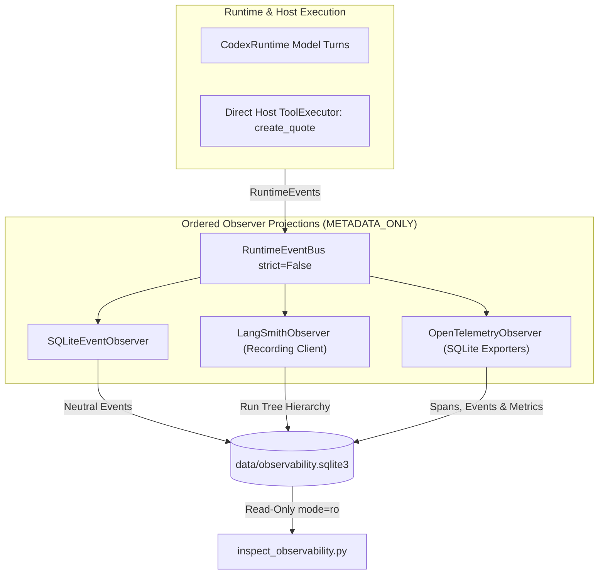

# Smart Quote Agent — CLI Demo

A complete, self-contained demonstration of **Proteo Runtime** showcasing LangGraph workflow orchestration, structured routing and parameter extraction, host-managed dynamic tools, strict tool segregation, dual-layer authorization, human-in-the-loop (HITL) confirmation, masked password authentication, authoritative integer-cent pricing, and atomic SQLite persistence.

---

## 1. Core Principles & Architecture

> **"The model may decide what it wants to do. The host decides what it is allowed to do and what is actually executed."**

The application enforces a clear **three-level separation of concerns**:
1. **Model / Intent Classification**: Identifies what action the user is attempting (including recognizing forbidden operations or unsupported requests) using a 10-action schema.
2. **Host Action Authorization Policy (`allowed_actions`)**: The host authoritatively evaluates whether that recognized action is valid and allowed for the current access level (anonymous, client, or staff). If denied, out of scope, a help request, or an acknowledgement, the host responds deterministically without invoking the controlled LLM.
3. **Host Tool Permission Policy (`ToolPermissionPolicy`)**: The host authoritatively mediates all tool execution via `ToolExecutor`. The conversational agent never has write tools in its registry.

### Recognized Application Actions
- `login`: Unequivocal direct command to authenticate/sign in (e.g. `login`, `iniciar sesion`).
- `logout`: User wants to sign out (e.g. `logout`, `cerrar sesion`).
- `help`: User asks what the agent can do, greets without a concrete request, or asks how to log in (e.g. `How can I login?`, `¿Cómo inicio sesión?`). Handled deterministically at host level.
- `acknowledgement`: Conversational pleasantries, closures, or confirmations (e.g. `gracias`, `thank you`, `perfecto`, `ok`). Handled deterministically with a polite host closure without invoking the controlled LLM.
- `catalog_query`: Product, catalog, or price availability questions.
- `quote_preview`: Non-persistent calculations or preliminary quote previews.
- `quote_history`: List or inspect persisted quotes (staff only).
- `customer_query`: List or search customers (staff only).
- `quote_create`: Create or persist a new quote for a customer (staff only).
- `out_of_scope`: Any request unrelated to Smart Quote Agent capabilities.

### Flow Architecture

```mermaid
flowchart TD
    User([User Input]) --> Router[Heuristic Router]
    Router -->|Unequivocal| DirectIntent{Intent}
    Router -->|Ambiguous| StructuredClassifier[Structured Classifier: structured / low]
    StructuredClassifier --> DirectIntent

    DirectIntent --> ScopeGate[Host Scope Gate: allowed_actions]

    ScopeGate -->|out_of_scope| OutOfScopeOutput[Host: Out-of-Scope Response]
    ScopeGate -->|help| HelpOutput[Host: Role-Specific Guidance / Login Guidance]
    ScopeGate -->|acknowledgement| AckOutput[Host: Polite Closure]
    ScopeGate -->|Unauthorized Action| DeniedOutput[Host: Permission Denied]

    ScopeGate -->|login allowed| LoginHITL[Masked Login Prompt]
    ScopeGate -->|logout allowed| Logout[Clear Auth State]
    ScopeGate -->|catalog_query / quote_preview / allowed quote_history| ControlledAgent[Controlled Agent: controlled_agent / low (RuntimeTask)]
    ScopeGate -->|quote_create allowed| AuthGuard[Host Auth Guard]

    AuthGuard -->|Staff| QuotePlanner[Quote Planner: structured / low]
    QuotePlanner -->|Incomplete / Missing Data| ClarifyPrompt[Host: Fine-Grained Clarification]
    QuotePlanner -->|Valid Request| ResolveData[Resolve DB IDs & Catalog Prices]
    ResolveData -->|Not Found / Ambiguous| AmbiguityMessage[Disambiguation / Error]
    ResolveData -->|Resolved| DiscountHITL[Discount HITL Prompt 0-30%]
    DiscountHITL --> QuoteReview[Authoritative Host Quote Review Display]
    QuoteReview --> CreateQuoteTool[Direct ToolExecutor: create_quote]
    ApprovalHITL[Phase 5 Console Approval]
    CreateQuoteTool --> ApprovalHITL
    ApprovalHITL -->|Approved| AtomicWrite[(SQLite: quotes & quote_lines)]
    ApprovalHITL -->|Denied| CancelledOutput[Quote Cancelled / Rollback]
```

---

## 2. Dual Execution Abstractions & Runtime Capabilities

The demo establishes two distinct execution abstractions, each configured explicitly at logical level `"low"`:

1. **`structured_model`** (`profile="structured"`, `level="low"`, `RuntimeModel`):
   - Invocation-scoped ephemeral model under `ContextPolicy.EXTERNAL`.
   - Used for deterministic JSON schema outputs (`IntentDecision` and `QuoteRequest`).
   - Does not bind tools; operates with structured output policies and strict schema validation (`extra="forbid"`).
   - Injected with role context and recognized actions, classifying user intent even if forbidden for the current role.
   - Instructed to extract only information explicitly stated and never invent or guess missing customer names, products, or quantities.
2. **`context_agent`** (`profile="controlled_agent"`, `level="low"`, `RuntimeTask`):
   - Task-scoped ephemeral multi-turn execution under `ContextPolicy.RUNTIME`.
   - Managed by `AgentSessionManager`, binding the task lifecycle to the active identity.
   - Provider-owned multi-turn conversational context: the provider thread maintains conversational history within the session, enabling follow-up turns (e.g., providing products in Turn 1 and customer in Turn 2) without re-asking.
   - Frozen authority: tool definitions, permissions, and initial instructions (`format_agent_instructions`) are frozen at task creation (`runtime.task(...)`). Post-creation modifications to external registries cannot expand authority.
   - User-only turns: task invocations accept user input directly (`task.ainvoke(user_input)`). Replaying messages or injecting per-turn system instructions is prohibited under `ContextPolicy.RUNTIME`.
   - Never exposed to `create_quote` (write tool segregation).
   - Identity lifecycle: on login or logout, previous tasks are cleanly closed (`task.close()`), tearing down provider threads and workspaces, and a fresh task is initialized with the new identity's tools.

### Experimental Dynamic Tools Flag
When instantiating `CodexRuntime`, the runtime must be initialized with:
```python
runtime = CodexRuntime(experimental_dynamic_tools=True)
```
`experimental_dynamic_tools=True` is required when binding host-managed tools to the `controlled_agent` profile. If disabled, `CodexRuntime` fails closed with `CapabilityError`.

### Graph Factory Parameters
The graph factory `create_demo_graph` accepts `context_agent` (either an active `RuntimeTask` or a callable returning the current `RuntimeTask`), along with optional `session_manager` (`AgentSessionManager`). For backward compatibility, `controlled_agent_model` is supported as an alias for `context_agent`. Both default to `None` for provider-free offline execution.

For callers that persist or round-trip `DemoState`, `quote_workflow` is the authoritative pending transaction. `quote_request` and `pending_quote_request` are intentionally lossy compatibility projections; they preserve customer/product text and quantities, but not workflow identity, revision, line IDs, or disambiguation candidates. A consumer must retain `quote_workflow` across turns to preserve edit targeting and stale-draft protection.

### Strict Structured Output Normalization (`strict=True` Compatibility)
When OpenAI/Codex evaluates structured output schemas in strict mode, it enforces three strict schema invariants:
1. Every property declared under `"properties"` must appear in the schema's `"required"` list.
2. Every object schema must specify `"additionalProperties": False`.
3. Schema properties must not define `"default"` keys.

To satisfy these invariants without sacrificing domain modeling flexibility (such as allowing `customer: str | None = None` and `items: list[RequestedItem] = Field(default_factory=list)`), the core provider normalizer (`_normalize_sdk_schema` in `src/proteo_runtime/providers/codex/_structured.py`) recursively walks Pydantic schemas:
- removes `"default"` keys so Codex does not reject default assignments;
- adds `"additionalProperties": False` to object schemas and definitions;
- ensures all declared `"properties"` are listed in `"required"`, while preserving nullable semantics using `anyOf: [{type: ...}, {type: "null"}]`.

This ensures that models like `QuoteRequest` extract `null` for omitted fields without runtime schema validation failures or artificial sentinel values.

### Conversational Tool Execution & Multi-Turn Coordination
- **Silence Tool Narration**: Controlled agents are instructed never to narrate tool execution or intermediate steps (e.g. "Voy a consultar...", "Let me check..."). Host-side processing additionally cleans any leading announcements before presenting responses.
- **Provider-Owned Read-Only Memory vs Host Workflow State**: The Codex provider thread remembers only the read-only turns sent to that task. LangGraph owns `QuoteWorkflowState` (workflow ID/revision, customer, stable lines, resolution status, and candidates); it does not replay host history into the runtime task.
- **Transactional Quote Workflow**: Pending quotes may be interrupted by product/customer/help/history queries, corrected, and resumed. A quote draft is tied to one workflow revision and cannot be reused after an edit or failed resolution.
- **Contextual Edits**: Product replacement preserves its quantity and unrelated lines; quantity-only input is accepted only for one uniquely missing quantity. Ambiguous references such as “ese/that” request clarification without changing the quote.

---

## 3. Tool Registry Segregation & Dual-Layer Authorization

The architecture enforces strict asymmetric tool distribution and dual-layer authorization:

### Tool Registries
- **Conversational Agent Registry** (`get_agent_tool_registry`):
  - Anonymous & Client: `list_products`, `find_product`, `calculate_quote`.
  - Staff: `list_products`, `find_product`, `calculate_quote`, `find_customer`, `list_customers`, `list_quotes`, `get_quote`.
  - **Absolute Segregation**: `create_quote` is **never** registered in the conversational agent's registry. Persistent quote mutation is entirely unreachable from conversational turns.
- **Dedicated Write Registry** (`get_quote_write_registry`):
  - Contains exclusively `create_quote`, bound specifically to the authenticated staff user.
  - Used only by `create_quote_tool_node` within the deterministic quote creation branch after approval.

### Dual-Layer Authorization
1. **Host Graph Guard** (`auth_guard_node`): Intercepts the request before any quote planning or database resolution takes place. Non-staff callers receive an immediate authorization denial.
2. **ToolPermissionPolicy**: Enforces fine-grained capability allow-lists inside `ToolExecutor` (`catalog.read`, `quote.calculate`, `customer.read`, `quote.create`, `quote.read`).

---

## 4. Host-Side Validation & Data Integrity

### Strict Schema Extraction & Fine-Grained Clarification
The Pydantic schemas in `models.py` guarantee that missing request data cannot be hallucinated into valid drafts:
- `RequestedItem`: `product: str | None = None`, `quantity: int | None = Field(default=None, gt=0)`
- `QuoteRequest`: `customer: str | None = None`, `items: list[RequestedItem] = Field(default_factory=list)`

Host-side validation inspects the extracted parameters and provides specific, language-aware feedback:
- **Missing customer only**: States that the customer name or identifier is required (e.g. *"Se requiere el nombre o identificador del cliente para crear una cotización."*).
- **Missing items only**: States that at least one product and positive quantity are required (e.g. *"Se requiere al menos un producto y su cantidad para crear una cotización."*).
- **Missing both**: Prompts for both customer and items with quantities.
- **Deterministic Localization**: Host messages detect the request language (`es` or `en`) via `detect_language` and respond accordingly.

If information is missing, the workflow halts immediately with clarification and does not proceed to database resolution or HITL.

### Disambiguation & SQL Wildcard Escaping
- In `database.py`, `_escape_like` escapes `%` and `_` characters in queries.
- If a search query matches multiple customers or products, `find_customer_by_query` and `find_product_by_query` return an explicit `ambiguous: True` result with candidate matches, preventing arbitrary selection.
- Customer and product search normalize accents/case and supported singular/plural variants. `mouse`, `mice`, and `mouses` may resolve to Wireless Mouse; `desk` never silently becomes `dock`.
- `list_customers` is staff-only, permission-gated by `customer.read`, capped at 50 rows, and returns only `id`, `code`, and `name`.

### Authoritative Price & Math Integrity
- The model is **never** trusted for pricing numbers or arithmetic calculations.
- Product unit prices are re-read directly from the SQLite `products` table in integer cents.
- Line subtotals, discount amounts, and totals are computed using whole-cent integer arithmetic and `ROUND_HALF_UP` rounding.

### Transactional SQLite Persistence
- Quote creation executes under `BEGIN IMMEDIATE TRANSACTION;` with `PRAGMA foreign_keys = ON;`.
- Inserts the `quotes` header and all `quote_lines` atomically.
- Automatically rolls back on any error or if human approval is denied.

---

## 5. Directory Layout

All application code, data, tests, and documentation are strictly contained within `examples/smart_quote_agent/`:

```text
examples/smart_quote_agent/
├── README.md               # Documentation and architectural guide (this file)
├── app.py                  # Interactive CLI application and unified REPL loop
├── auth.py                 # Masked authentication, sanitized identity, and role policies
├── database.py             # Schema DDL, search helpers, and atomic persistence
├── graph.py                # LangGraph StateGraph compiling hybrid deterministic/agent workflow
├── hitl.py                 # Discount prompt and Phase 5 ConsoleApprovalHandler
├── init_demo.py            # SQLite schema provisioning and seed script
├── models.py               # Pydantic schemas, TypedDict state, and inputs
├── data/
│   └── .gitkeep            # Local placeholder for demo.sqlite3
└── tests/
    ├── __init__.py         # Test package initialization
    └── test_agent.py       # 24-point audit and hardening regression test suite
```

---

## 6. Demo Credentials & Access Matrix

All demo accounts use the trivial password `1234` for ease of local testing:

| Role | Customer Associated | Allowed Actions (`allowed_actions`) | Permissions (`ToolPermissionPolicy`) | Conversational Tools Available |
|---|---|---|---|---|
| `staff` | *None* | `logout`, `help`, `acknowledgement`, `catalog_query`, `quote_preview`, `quote_history`, `customer_query`, `quote_create` | `catalog.read`, `quote.calculate`, `customer.read`, `quote.create`, `quote.read` | `list_products`, `find_product`, `calculate_quote`, `find_customer`, `list_customers`, `list_quotes`, `get_quote` |
| `client1` (`client`) | Acme Corp. (`1`) | `logout`, `help`, `acknowledgement`, `catalog_query`, `quote_preview` | `catalog.read`, `quote.calculate` | `list_products`, `find_product`, `calculate_quote` |
| `client2` (`client`) | Globex LLC (`2`) | `logout`, `help`, `acknowledgement`, `catalog_query`, `quote_preview` | `catalog.read`, `quote.calculate` | `list_products`, `find_product`, `calculate_quote` |
| `client3` (`client`) | Initech (`3`) | `logout`, `help`, `acknowledgement`, `catalog_query`, `quote_preview` | `catalog.read`, `quote.calculate` | `list_products`, `find_product`, `calculate_quote` |
| `client4` (`client`) | Northwind Traders (`4`) | `logout`, `help`, `acknowledgement`, `catalog_query`, `quote_preview` | `catalog.read`, `quote.calculate` | `list_products`, `find_product`, `calculate_quote` |
| *Anonymous* | *None* | `login`, `help`, `acknowledgement`, `catalog_query`, `quote_preview` | `catalog.read`, `quote.calculate` | `list_products`, `find_product`, `calculate_quote` |

> [!WARNING]
> **Demo Security Disclaimer**: Authentication in this example is intended exclusively for demonstrating host-managed authorization and HITL workflows. It does not use salted password hashing, JWT tokens, or production IAM infrastructure.

---

## 7. Setup & Initialization

Ensure dependencies are installed using `uv` with the required extras:

```bash
# Sync project dependencies including LangGraph and OpenTelemetry SDK
uv sync --extra dev --extra langgraph --extra otel
```

> [!NOTE]
> The `--extra otel` option installs `opentelemetry-sdk` (and API), which provides the in-process tracer and meter providers and processors used by `otel_recording.py` for local SQLite telemetry recording. `--extra langgraph` installs LangGraph and LangSmith client libraries.

Initialize or reset the local SQLite databases:

```bash
# Initialize or reset the local SQLite database with demo products, users, and customers
uv run python examples/smart_quote_agent/init_demo.py --reset

# Initialize or reset the local telemetry database (observability.sqlite3)
uv run python examples/smart_quote_agent/init_observability.py --reset
```

Output:
```text
Smart Quote Agent demo initialized.

Database:
.../examples/smart_quote_agent/data/demo.sqlite3

Users:
staff   / 1234
client1 / 1234
client2 / 1234
client3 / 1234
client4 / 1234
```

---

## 8. Running the Application

### Live Mode (Requires Codex / Provider Credentials)
```bash
uv run python examples/smart_quote_agent/app.py
```

### Offline Deterministic Mode (Provider-Free / Zero-Quota)
For automated verification, testing, or environments without live API credentials, pass `--offline`:
```bash
uv run python examples/smart_quote_agent/app.py --offline
```
Offline mode can also calculate a non-persistent preview for explicit active-catalog items, for example `calcular presupuesto preliminar de 2 Notebook Pro y 3 mouses`. It uses the host's `calculate_quote` tool and SQLite prices; generic product names such as `notebook` prompt for disambiguation instead of choosing a model. No quote is saved.

### Running the Test Suite
The complete provider-free test suite, including audit, containment, and conversational hardening regressions, runs with zero model quota consumption:
```bash
uv run pytest examples/smart_quote_agent/tests
```

---

## 9. Interactive Scenarios & Transcripts

### Scenario A: General Capabilities & Assistant Guidance (Host Deterministic, Localized)
```text
> Que cosas podría hacer?

Puedo ayudarte a consultar productos y precios o calcular presupuestos preliminares. También podés iniciar sesión; las funciones adicionales dependen de tu rol.

> help

I can help you consult products and prices or calculate preliminary quote previews. You can also log in; additional capabilities depend on your role.
```

### Scenario B: Informational Login Inquiry vs Direct Login Command
```text
> Como inicio sesion?

Escribí 'login' para iniciar sesión.

> login
Username: staff
Password: [MASKED]
Logged in as Demo Staff (staff)
```

### Scenario C: Conversational Pleasantries & Acknowledgements (Host Closed, No LLM Call)
```text
> Muchas gracias

De nada.

> thank you

You're welcome.
```

### Scenario D: Application-Scope Containment (Unsupported General-Purpose Requests)
```text
> Write a python script to parse CSV files

That request is outside the scope of this agent. I can help you consult products, prices, or calculate a preliminary quote preview.

> Search the web for latest tech news

That request is outside the scope of this agent. I can help you consult products, prices, or calculate a preliminary quote preview.
```

### Scenario E: Anonymous Catalog Exploration & Authorization Denied
```text
> What notebooks do you have?

Available products:
- Notebook Air (NB-AIR): $900.00
- Notebook Pro (NB-PRO): $1,200.00
- Wireless Mouse (MS-WL): $40.00
- Mechanical Keyboard (KB-MECH): $85.00
- 27" Monitor (MON-27): $320.00
- USB-C Dock (DOCK-USBC): $150.00

> Create a quote for Globex for 2 Notebook Pro.

Access denied. Persisted quotes can only be created by staff.
```

### Scenario F: Client Login & Authorization Denied
```text
> login
Username: client2
Password: [MASKED]
Logged in as Client 2 (client)

[client2] > Create a quote for Globex for 2 Notebook Pro.

Access denied. Persisted quotes can only be created by staff.

[client2] > logout
Logged out. Continuing as anonymous.
```

### Scenario G: Incomplete Quote Request (Fine-Grained Clarification Safeguards)
```text
# Missing customer only:
[staff] > Crear cotización de 2 Wireless Mouse

Se requiere el nombre o identificador del cliente para crear una cotización. Por favor especifica el cliente (ej. 'para Globex').

# Missing items only:
[staff] > Crear cotización para Acme

Se requiere al menos un producto y su cantidad para crear una cotización. Por favor especifica los productos (ej. '2 Notebook Pro').

# Missing both:
[staff] > Create a quote

Could not extract quote details. Please specify both the customer name and items with quantities (e.g. 'Create a quote for Globex for 2 Notebook Pro').
```

### Scenario H: Ambiguous Search Query (Disambiguation Safeguard)
```text
[staff] > Create a quote for Globex for 2 Notebook

Multiple products matched 'Notebook': Notebook Pro (NB-PRO), Notebook Air (NB-AIR). Please specify exact SKU or name.
```

### Scenario I: Staff Login, Discount HITL, Host Quote Review & Approved Creation
```text
> login
Username: staff
Password: [MASKED]
Logged in as Demo Staff (staff)

[staff] > Create a quote for Globex for 3 Notebook Pro and 5 Wireless Mouse.

Subtotal: $3,800.00
Apply discount? [y/N]: y
Discount percentage [0-30, default 0]: 10

==================================================
HOST QUOTE REVIEW
==================================================
Customer: Globex LLC (ID: 2)
Line items:
  - Notebook Pro (NB-PRO): 3x @ $1,200.00 = $3,600.00
  - Wireless Mouse (MS-WL): 5x @ $40.00 = $200.00
Subtotal:        $3,800.00
Discount:        10% ($380.00)
Total:           $3,420.00
==================================================

[APPROVAL REQUIRED] Tool execution requested: create_quote
Customer ID: 2
Discount: 10%

Approve quote creation? [y/N]: y
[APPROVED] Action approved.

[SUCCESS] Quote #1 created for Globex LLC.
Total: $3,420.00
```

### Scenario J: Staff Quote Creation Denied at Final Approval
```text
[staff] > Create a quote for Globex for 1 Notebook Air.

Subtotal: $900.00
Apply discount? [y/N]: n

==================================================
HOST QUOTE REVIEW
==================================================
Customer: Globex LLC (ID: 2)
Line items:
  - Notebook Air (NB-AIR): 1x @ $900.00 = $900.00
Subtotal:        $900.00
Discount:        0% ($0.00)
Total:           $900.00
==================================================

[APPROVAL REQUIRED] Tool execution requested: create_quote
Customer ID: 2
Discount: 0%

Approve quote creation? [y/N]: n
[DENIED] Action denied by user.

Quote creation was denied by user. Nothing was persisted.
```

### Scenario I: Inspecting Quote History (Staff Only)
```text
[staff] > Show the latest quotes

Recent quotes:
- Quote #1 (Globex LLC): $3,420.00

[staff] > Show quote 1

Quote #1 for Globex LLC:
  3x Notebook Pro ($1,200.00) = $3,600.00
  5x Wireless Mouse ($40.00) = $200.00
Subtotal: $3,800.00
Discount: 10% ($380.00)
Total: $3,420.00

[staff] > exit
Goodbye.
```

---

---

## 10. Phase 2: Observability & Telemetry Architecture

Phase 2 adds local, content-safe inspection of the agent's runtime behavior without modifying business behavior or requiring external cloud infrastructure.



### Architectural Principles

1. **Provider-Neutral Source of Truth**: Telemetry is not generated by wrapping third-party SDKs directly. Instead, all activity flows through Proteo's neutral `RuntimeEventBus`.
2. **Three Parallel Representations**:
   - **Neutral Proteo Events**: Stored chronologically in `runtime_events` with extracted scalar fields (`model`, `profile`, `duration_ms`, `tool_name`, `status`).
   - **LangSmith Projection**: Recorded in `langsmith_runs` and reconstructed as a parent-child execution tree (`proteo.runtime` → `proteo.turn` → `proteo.tool`).
   - **OpenTelemetry Projection**: Recorded in `otel_spans`, `otel_span_events`, and `otel_metrics` with duration measurements, lifecycle events (`tool_approval_requested`), and low-cardinality counters.
3. **Strict Content Safety (`PayloadMode.METADATA_ONLY`)**:
   Prompts, model responses, passwords, raw arguments, and exception tracebacks are never persisted. Only structural identifiers and safe metadata are stored.
4. **Failure Isolation**:
   `strict=False` ensures that observer or telemetry storage failures never interrupt agent inference or prevent quote creation. If a failure occurs, the bus logs a diagnostic and transitions to `ObservabilityStatus.DEGRADED`.
5. **Direct Host-Side Tool Wiring**:
   Application-created `ToolExecutor` instances (specifically the host-managed `create_quote` executor) dispatch lifecycle events directly into the observability pipeline via their public `event_sink` hook.

### Storage Layout Separation

Business data and telemetry data are kept in strictly separated SQLite databases with zero cross-database foreign keys:

- `data/demo.sqlite3`: Business domain (`users`, `customers`, `products`, `quotes`, `quote_lines`).
- `data/observability.sqlite3`: Telemetry domain (`runtime_events`, `langsmith_runs`, `otel_spans`, `otel_span_events`, `otel_metrics`), configured with `PRAGMA journal_mode = WAL;` and `PRAGMA busy_timeout = 5000;`.

### Observability Modes

Controlled via the `DEMO_OBSERVABILITY` environment variable:

- `DEMO_OBSERVABILITY=local` (Default): All 3 local SQLite recorders active; zero external credentials required.
- `DEMO_OBSERVABILITY=off`: Observability disabled; event bus binds zero observers.
- `DEMO_OBSERVABILITY=local+langsmith`: Local recording plus live export to LangSmith SaaS (requires `LANGSMITH_API_KEY`).

---

## 11. Dual-Terminal Demonstration Walkthrough

This walkthrough demonstrates running the interactive Smart Quote Agent in one terminal while inspecting its runtime telemetry, LangSmith projection, and OpenTelemetry traces in a second terminal.

### Step 0: Initialize Databases

Reset both business and telemetry databases to a clean, known state:

```powershell
python init_demo.py --reset
python init_observability.py --reset
```

Output:
```text
[OK] Initialized database schema at: data/demo.sqlite3
[OK] Seeded 4 customers, 5 users, and 6 products.
[OK] Initialized telemetry database at: data/observability.sqlite3
```

---

### Step 1: Start the Agent (Terminal 1)

In **Terminal 1**, start the Smart Quote Agent CLI:

```powershell
python app.py
```

```text
============================================================
Proteo Runtime - Smart Quote Agent
============================================================

Modo actual: Anónimo

Este demo permite consultar el catálogo activo y preparar cotizaciones.
Los precios se calculan desde el catálogo local de demostración.

Modos de acceso:
- Anónimo: consulta productos y calcula vistas preliminares; no guarda cotizaciones.
- Cliente: lo mismo, asociado a su empresa; no crea cotizaciones guardadas.
- Staff: puede listar clientes, ver cotizaciones y crear con aprobación.

Para iniciar sesión, escribí 'login' y completá usuario y contraseña.
La contraseña se ingresa oculta. Credenciales de este demo (todas usan 1234):
- Staff: staff
- Clientes: client1 (Acme Corp.), client2 (Globex LLC),
  client3 (Initech), client4 (Northwind Traders)
Son cuentas de demostración; no las uses fuera de este ejemplo.

Escribí 'logout' para volver al modo anónimo y 'exit' para salir.

> ¿Qué productos activos hay?
```

The agent invokes the controlled agent model, queries the host catalog tool, and presents the available products.

---

### Step 2: Inspect Invocations & Telemetry (Terminal 2)

In **Terminal 2**, list recent Proteo runtime invocations:

```powershell
python inspect_observability.py
```

Output:
```text
Recent Proteo invocations
────────────────────────────────────────────────────────────

#   Invocation        Started     Duration   Tools   Status    
1   inv_8ca1b902...   12:41:02    4.21 s     1       completed 

Note: Host-only interactions (such as help, login, logout, scope rejection, or discount prompts) do not trigger runtime invocations.
```

Now inspect the detailed execution breakdown:

```powershell
python inspect_observability.py --last
```

Output:
```text
Invocation inv_8ca1b902...
Started:    2026-09-16T12:41:02.105+00:00
Status:     completed
Model:      gpt-4o-mini
Profile:    controlled_agent
Reasoning:  low
Duration:   4210 ms

Runtime Events
────────────────────────────────────────
12:41:02  invocation_started
12:41:02  turn_started
12:41:03  tool_requested          list_products
12:41:03  tool_started            list_products
12:41:03  tool_completed          list_products
12:41:04  turn_completed
12:41:04  invocation_completed

LangSmith Projection
────────────────────────────────────────
proteo.runtime
└── proteo.turn
    └── proteo.tool [list_products]

OpenTelemetry Spans
────────────────────────────────────────
proteo.invocation        4210 ms
└── proteo.turn          4178 ms
    └── proteo.tool        12 ms

OpenTelemetry Metrics — recent/aggregate
────────────────────────────────────────
proteo.runtime.duration        4210 ms
proteo.runtime.events                7
proteo.runtime.invocations           1
proteo.runtime.tool_calls            1
```

---

### Step 3: Authenticate as Staff (Terminal 1)

In **Terminal 1**, authenticate with staff credentials:

```text
> login
Username: staff
Password: [masked]

Logged in as Demo Staff (staff)
[staff] >
```

In **Terminal 2**, inspect invocations again:

```powershell
python inspect_observability.py
```

Notice that invocation #1 remains the last invocation:
```text
Note: Host-only interactions (such as help, login, logout, scope rejection, or discount prompts) do not trigger runtime invocations.
```
Login is managed entirely host-side with masked input; credentials never touch the runtime event stream or telemetry database.

---

### Step 4: Create an Approved Quote (Terminal 1)

In **Terminal 1**, request a persisted quote:

```text
[staff] > Create a quote for Globex for 2 Notebook Pro
Apply discount? [y/N]: y
Discount percentage [0-30, default 0]: 10

==================================================
HOST QUOTE REVIEW
==================================================
Customer: Globex LLC (ID: 2)
Line items:
  - Notebook Pro (NB-PRO): 2x @ $1,200.00 = $2,400.00
Subtotal:        $2,400.00
Discount:        10% ($240.00)
Total:           $2,160.00
==================================================

[APPROVAL REQUIRED] Tool execution requested: create_quote
Customer ID: 2
Discount: 10%

Approve quote creation? [y/N]: y
[APPROVED] Action approved.

[SUCCESS] Quote #1 created for Globex LLC.
Total: $2,160.00
```

---

### Step 5: Inspect Quote Creation Telemetry (Terminal 2)

In **Terminal 2**, view the latest invocation:

```powershell
python inspect_observability.py --last
```

Output highlights:
- **Direct Tool Lifecycle Events**: Displays `tool_requested`, `tool_approval_requested`, `tool_approval_resolved`, `tool_started`, and `tool_completed` captured via the direct `event_sink` wiring.
- **OpenTelemetry Span Events**: Span `proteo.tool` includes `event: tool_approval_requested` and `event: tool_approval_resolved`.

You can also isolate specific projections using flags:

```powershell
# Inspect only runtime events
python inspect_observability.py --last --events

# Inspect only the LangSmith run tree
python inspect_observability.py --last --langsmith

# Inspect only OpenTelemetry spans and metrics
python inspect_observability.py --last --otel

# Reconstruct all RuntimeTask turns plus host transitions for a task
python inspect_observability.py --task <task-id>

# Inspect transitions for one pending/persisted quote workflow
python inspect_observability.py --workflow <workflow-id>

# Inspect runtime events and sanitized host diagnostics for one CLI interaction
python inspect_observability.py --interaction <interaction-id>
```

Task, workflow, and interaction timelines are metadata-only. The interaction view can show an incomplete runtime call as failed when a correlated `host.turn_error` exists, including sanitized stage, exception type/code, causal types, and traceback locations; it never displays exception messages or local variables. The task view also surfaces provider cleanup diagnostics such as `task.cleanup.provider_delete_failed`. OpenTelemetry metrics shown with an invocation remain cumulative for the local telemetry database and are labeled accordingly; they are not invocation-scoped.

---

## 12. 44-Point Audit, Scope Containment & Verification Matrix


The test suite in `examples/smart_quote_agent/tests/test_agent.py` validates 44 distinct architectural audit and containment points:

### Core Architecture & Workflow (Points 1–24)
1. **Deterministic Router**: Unequivocal phrases (`login`, `logout`, `create quote`, `products`) route without LLM invocation.
2. **Ambiguous Routing**: Ambiguous inputs invoke the low-level structured classifier.
3. **Controlled Agent Queries**: Capability and catalog queries reach the controlled agent path.
4. **Distinct Model Bindings**: `structured_model` and `controlled_agent_model` are separate bindings.
5. **Low Level Profile**: Every model binding strictly uses logical level `"low"`.
6. **Dynamic Tool Binding**: Controlled agent successfully binds host tools without `CapabilityError`.
7. **Runtime Flag**: Runtime configuration enforces `experimental_dynamic_tools=True`.
8. **Tool Segregation**: Conversational agent registry **never** exposes `create_quote`.
9. **Anonymous Authorization Guard**: Anonymous users cannot enter the quote creation workflow.
10. **Client Authorization Guard**: Authenticated clients cannot create persisted quotes.
11. **Staff Authorization Guard**: Authenticated staff enter the quote creation workflow.
12. **Anti-Hallucination Extraction**: Missing customer or items cannot be invented into a valid draft.
13. **Discount Bounds**: Discount defaults to 0 and enforces strict 0..30 bounds.
14. **Approval Denial Rollback**: Denying Phase 5 approval writes nothing to the database.
15. **Approval Success Atomicity**: Approved quote writes header and all line items atomically.
16. **Authoritative Prices**: Product unit prices are re-read from the database before persistence.
17. **Tool Result Accuracy**: Persistence failures are never reported as tool successes.
18. **Quote Inspection Privacy**: Quote listing and details are restricted to staff.
19. **Call ID Isolation**: Invocations generate unique UUID call IDs and cleanly end invocations.
20. **Disambiguation Safety**: Ambiguous customer/product searches never pick arbitrarily.
21. **Zero Credential Leakage**: Passwords never enter `DemoState`, runtime inputs, or logs.
22. **Interactive Isolation**: Custom test input functions do not block on builtin terminal input.
23. **Transparent Exceptions**: Live model exceptions (e.g. `TransportError`) propagate cleanly without being swallowed.
24. **Legacy Signature Removal**: The legacy single `model` parameter is completely removed from `create_demo_graph`.

### Application-Scope Containment (Points 25–44 / `test_scope_01` – `test_scope_20`)
25. **Scope Heuristic Help/Greeting**: Exact greeting and help phrases route deterministically to `help` without LLM invocation.
26. **Scope Heuristic Unequivocal Catalog**: Exact catalog and product phrases route deterministically to `catalog_query` without LLM invocation.
27. **Scope Heuristic Unequivocal Quotes**: Exact quote phrases route deterministically to `quote_history` without LLM invocation.
28. **Scope Heuristic Ambiguity Deferral**: Open-ended or arbitrary tasks return `None` from heuristic and defer to the structured classifier.
29. **Scope Classifier Out-of-Scope Recognition**: Generic assistant requests (coding, essays, web search, image generation) are classified as `out_of_scope`.
30. **Scope Classifier Catalog Recognition**: Product and price queries are classified as `catalog_query`.
31. **Scope Classifier Role Context**: Classifier prompt receives current access level and allowed actions context.
32. **Scope Policy Anonymous**: Anonymous user policy contains only public actions (`login`, `help`, `catalog_query`, `quote_preview`).
33. **Scope Policy Client**: Client user policy excludes quote creation and quote history (`logout`, `help`, `catalog_query`, `quote_preview`).
34. **Scope Policy Staff**: Staff user policy includes all supported actions (`logout`, `help`, `catalog_query`, `quote_preview`, `quote_history`, `quote_create`).
35. **Scope Gate Out-of-Scope (Anonymous)**: Unsupported queries return concise host containment reply without invoking the controlled LLM.
36. **Scope Gate Out-of-Scope (Staff)**: Unsupported queries for staff also return concise host containment reply without invoking the controlled LLM.
37. **Scope Gate Help (Anonymous)**: Returns deterministic public guidance host-side without LLM invocation.
38. **Scope Gate Help (Staff)**: Returns deterministic staff guidance host-side without LLM invocation.
39. **Scope Gate Allowed Catalog Query**: Supported catalog inquiries pass the scope gate and reach the controlled agent.
40. **Scope Gate Allowed Quote Preview**: Supported preliminary quote preview requests pass the scope gate and reach the controlled agent.
41. **Scope Gate Allowed Staff History**: Quote history inquiries for staff pass the scope gate and reach the controlled agent.
42. **Scope Controlled Agent Instruction**: Controlled agent system instruction explicitly disclaims generic assistant capabilities (browsing, files, code execution, image generation, external apps).
43. **Scope Action Matrix Full Sweep**: Complete matrix of 8 actions verified across anonymous, client, and staff access levels.
44. **Scope End-to-End Workflow Integrity**: Quote creation, HITL discount, review display, approval, and SQLite persistence continue operating without regressions.

---

## 13. Security Boundaries & Invariants

### Guarantees Enforced:
- **Application-Scope Containment**: General-purpose assistant requests (browsing the internet, analyzing arbitrary files, writing code, generating images, connecting external apps) are classified as `out_of_scope` and intercepted host-side by `scope_gate_node` without consuming controlled agent LLM turns. The controlled agent prompt provides defense-in-depth disclaimers.
- **Host-Owned Credentials**: Passwords collected via `getpass` are evaluated in-memory and deleted (`del password`). They never enter LangGraph state, runtime inputs, tool arguments, or telemetry.
- **Dual-Layer Authorization**: Host Graph Guard rejects unauthorized users before quote planning; `ToolPermissionPolicy` enforces fine-grained permissions inside `ToolExecutor`.
- **Absolute Tool Segregation**: The conversational agent registry *never* contains `create_quote`. Write mutations are exclusively reachable through the deterministic workflow path.
- **Authoritative Price Integrity**: The model is never trusted for pricing or calculation math. Prices are re-read directly from SQLite, and line subtotals and discounts use integer whole-cent arithmetic.
- **Disambiguation & SQL Escaping**: SQL LIKE wildcards (`%`, `_`) are escaped, and multiple matches trigger candidate disambiguation instead of arbitrary selection.
- **Transactional Atomicity**: Quotes are persisted under `BEGIN IMMEDIATE TRANSACTION;` with automatic rollback on error or approval denial.
- **Sandboxed Tool Scope**: Host-managed tools have **no access** to the OS shell, filesystem, or browser. Network transport connects exclusively to the configured model provider.
- **Transparent Error Propagation**: Live model exceptions surface cleanly without silent fallback swallowing.

---

## 14. Conversational Continuity and Workflow Inspection

Quote creation is a host-owned transaction that remains available while the user asks read-only questions. The model may propose an edit, but the host validates its target, resolves canonical entities, reads prices from SQLite, and guards the draft by workflow ID and revision.

Example continuation:

```text
[staff] > Quisiera armar un presupuesto por un desk y 2 mouses
Se requiere el cliente y el producto desk no existe; la cotización queda pendiente.

[staff] > Muéstrame la lista de clientes
Clientes: ...
La cotización sigue pendiente. El próximo dato pendiente es el cliente.

[staff] > ¿Qué productos activos hay?
Productos activos: ... USB-C Dock (DOCK-USBC) ...
La cotización sigue pendiente. El producto desk necesita una referencia válida.

[staff] > Para Globex, quiero un dock en vez de un desk
El USB-C Dock reemplaza solo la línea desk; las otras líneas se conservan.

[staff] > Cantidad 1
La cantidad se aplica al único producto pendiente.

[staff] > Sí, agrega ese
Si “ese” no coincide con una única referencia guardada, el agente pregunta cuál producto y no cambia la cotización.
```

An explicit full quote request may replace the current line set; an edit such as “dock en vez de desk” may not. Multiple unresolved quantity targets or candidate references are clarified without changing quote data or revision. Cancel, logout, approval denial, successful persistence, and terminal persistence failure discard the pending workflow and all draft references.

`RuntimeTask` memory is limited to read-only turns that were actually sent to the active identity's task. Quote workflow state is never stored in that task or replayed as host-side history. The local inspector can reconstruct task and workflow timelines without user content:

```powershell
python examples/smart_quote_agent/inspect_observability.py --task <task-id>
python examples/smart_quote_agent/inspect_observability.py --workflow <workflow-id>
```

The telemetry migration adds nullable `task_id` and `interaction_id` to the local observability database only. It does not change or reset `demo.sqlite3`; provider cleanup behavior remains outside the example, though diagnostics such as `task.cleanup.provider_delete_failed` are surfaced by the inspector.
