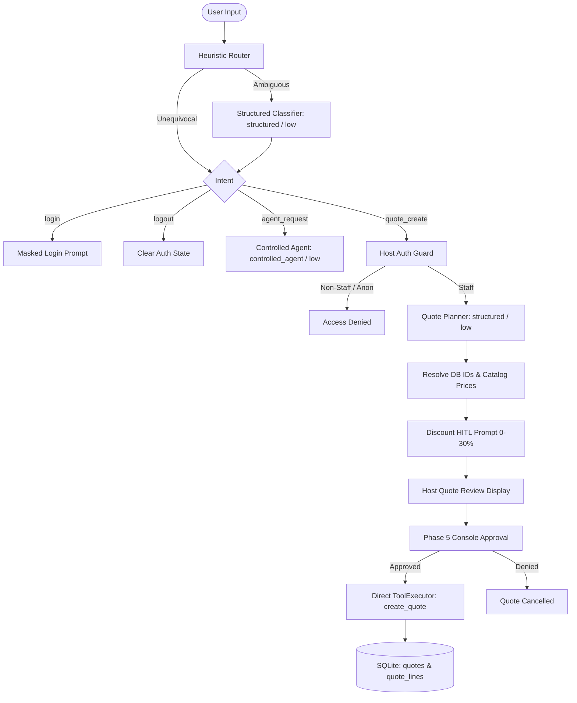

# Smart Quote Agent — CLI Demo

A complete, self-contained demonstration of **Proteo Runtime** showcasing LangGraph orchestration, structured routing and extraction, host-managed dynamic tools, dual-layer authorization, human-in-the-loop (HITL) confirmation, masked password authentication, and atomic SQLite persistence.

---

## 1. Core Principles & Architecture

> **"The model may decide what it wants to do. The host decides what it is allowed to do and what is actually executed."**

The architecture is deliberately partitioned into two operational spheres:
- **Controlled Conversational Agent**: Handles open-ended natural language inquiries (e.g., product catalog lookup, item specifications, calculation previews, and general assistant guidance) using host-managed tools. Under **no circumstances** does this agent receive the `create_quote` tool.
- **Deterministic State Workflow**: Governs privileged mutations (quote planning, customer resolution, discount selection via HITL, dual-layer authorization checks, human write confirmation, and atomic SQLite persistence).



---

## 2. Dual Model Bindings & Runtime Capabilities

The demo requires and establishes two distinct model bindings:

1. **`structured_model`** (`profile="structured"`, `level="low"`):
   - Used for deterministic JSON schema outputs (`IntentDecision` and `QuoteRequest`).
   - Does not bind tools; operates with structured output policies and strict schema validation.
2. **`controlled_agent_model`** (`profile="controlled_agent"`, `level="low"`):
   - Used for conversational tool use and general assistant inquiries.
   - Bound with host-managed tools via `.with_tools(agent_registry, executor=executor)`.

### Experimental Dynamic Tools Flag
When instantiating `CodexRuntime`, the runtime must be passed:
```python
runtime = CodexRuntime(experimental_dynamic_tools=True)
```
`experimental_dynamic_tools=True` is required when binding host-managed tools to the `controlled_agent` profile. If it is disabled, CodexRuntime fails closed with `CapabilityError`.

---

## 3. Directory Layout

All application code, data, tests, and documentation are strictly contained within `examples/smart_quote_agent/`:

```text
examples/smart_quote_agent/
├── README.md               # Documentation and architectural guide (this file)
├── app.py                  # Interactive CLI application and unified REPL loop
├── init_demo.py            # SQLite schema provisioning and seed script
├── database.py             # Schema DDL, search helpers, and atomic persistence
├── models.py               # Pydantic schemas, TypedDict state, and inputs
├── auth.py                 # Masked authentication, sanitized identity, and policies
├── tools.py                # Host-managed tools (@runtime_tool) and registry factories
├── graph.py                # LangGraph StateGraph compiling hybrid workflow
├── hitl.py                 # Discount prompt and Phase 5 ConsoleApprovalHandler
├── data/
│   └── .gitkeep            # Local placeholder for demo.sqlite3
└── tests/
    ├── __init__.py         # Test package initialization
    └── test_agent.py       # Comprehensive 23-point audit test suite
```

---

## 4. Demo Credentials & Access Matrix

All demo accounts use the trivial password `1234` for ease of local testing:

| Username | Password | Role | Customer Associated | Permissions | Conversational Tools Available |
|---|---|---|---|---|---|
| `staff` | `1234` | `staff` | *None* | `catalog.read`, `quote.calculate`, `customer.read`, `quote.create`, `quote.read` | `list_products`, `find_product`, `calculate_quote`, `find_customer`, `list_quotes`, `get_quote` |
| `client1` | `1234` | `client` | Acme Corp. (`1`) | `catalog.read`, `quote.calculate` | `list_products`, `find_product`, `calculate_quote` |
| `client2` | `1234` | `client` | Globex LLC (`2`) | `catalog.read`, `quote.calculate` | `list_products`, `find_product`, `calculate_quote` |
| `client3` | `1234` | `client` | Initech (`3`) | `catalog.read`, `quote.calculate` | `list_products`, `find_product`, `calculate_quote` |
| `client4` | `1234` | `client` | Northwind Traders (`4`) | `catalog.read`, `quote.calculate` | `list_products`, `find_product`, `calculate_quote` |
| *Anonymous* | — | *None* | *None* | `catalog.read`, `quote.calculate` | `list_products`, `find_product`, `calculate_quote` |

> [!WARNING]
> **Demo Security Disclaimer**: Authentication in this example is intended exclusively for demonstrating host-managed authorization and HITL workflows. It does not use salted password hashing, JWT tokens, or production IAM infrastructure.

---

## 5. Setup & Initialization

Ensure dependencies are installed using `uv`:

```bash
# Initialize or reset the local SQLite database with demo products, users, and customers
uv run python examples/smart_quote_agent/init_demo.py --reset
```

Output:
```text
Smart Quote Agent demo initialized.

Database:
.../examples/smart_quote_agent/data/demo.sqlite3

Users:
staff   / 1234
client1 / 1234
client2 / 1234
client3 / 1234
client4 / 1234
```

---

## 6. Running the Application

### Live Mode (Requires Codex / Provider Credentials)
```bash
uv run python examples/smart_quote_agent/app.py
```

### Offline Deterministic Mode (Provider-Free / Zero-Quota)
For automated verification, testing, or environments without live API credentials, pass `--offline`:
```bash
uv run python examples/smart_quote_agent/app.py --offline
```

### Running the Test Suite
The complete 23-point audit and hardening test suite runs deterministically with zero quota consumption:
```bash
uv run pytest examples/smart_quote_agent/tests
```

---

## 7. Interactive Scenarios & Transcripts

### Scenario A: General Capabilities & Natural Guidance
```text
> Que puedo hacer con este agente?

Soy el asistente Smart Quote. Puedo ayudarte con:
1. Consultar el catálogo de productos y especificaciones disponibles.
2. Calcular subtotales y presupuestos preliminares sin compromiso.
3. Si eres personal de ventas (staff), registrar cotizaciones formales con descuentos y persistencia en base de datos.
4. Revisar el historial de cotizaciones recientes emitidas para clientes.

Para comenzar, puedes escribir 'productos' o iniciar sesión con 'login'.
```

### Scenario B: Anonymous Catalog Exploration & Authorization Denied
```text
> What notebooks do you have?

Available products:
- Notebook Air (NB-AIR): $900.00
- Notebook Pro (NB-PRO): $1,200.00
- Wireless Mouse (MS-WL): $40.00
- Mechanical Keyboard (KB-MECH): $85.00
- 27" Monitor (MON-27): $320.00
- USB-C Dock (DOCK-USBC): $150.00

> Create a quote for Globex for 2 Notebook Pro.

Access denied. Persisted quotes can only be created by staff.
```

### Scenario C: Client Login & Authorization Denied
```text
> login
Username: client2
Password: [MASKED]
Logged in as Client 2 (client)

[client2] > Create a quote for Globex for 2 Notebook Pro.

Access denied. Persisted quotes can only be created by staff.

[client2] > logout
Logged out. Continuing as anonymous.
```

### Scenario D: Staff Login, Discount HITL & Final Approval
```text
> login
Username: staff
Password: [MASKED]
Logged in as Demo Staff (staff)

[staff] > Create a quote for Globex for 3 Notebook Pro and 5 Wireless Mouse.

Subtotal: $3,800.00
Apply discount? [y/N]: y
Discount percentage [0-30, default 0]: 10

==================================================
HOST QUOTE REVIEW
==================================================
Customer: Globex LLC (ID: 2)
Line items:
  - Notebook Pro (NB-PRO): 3x @ $1,200.00 = $3,600.00
  - Wireless Mouse (MS-WL): 5x @ $40.00 = $200.00
Subtotal:        $3,800.00
Discount:        10% ($380.00)
Total:           $3,420.00
==================================================

[APPROVAL REQUIRED] Tool execution requested: create_quote
Customer ID: 2
Discount: 10%

Approve quote creation? [y/N]: y
[APPROVED] Action approved.

[SUCCESS] Quote #1 created for Globex LLC.
Total: $3,420.00
```

### Scenario E: Inspecting Quote History (Staff Only)
```text
[staff] > Show the latest quotes

Recent quotes:
- Quote #1 (Globex LLC): $3,420.00

[staff] > Show quote 1

Quote #1 for Globex LLC:
  3x Notebook Pro ($1,200.00) = $3,600.00
  5x Wireless Mouse ($40.00) = $200.00
Subtotal: $3,800.00
Discount: 10% ($380.00)
Total: $3,420.00

[staff] > exit
Goodbye.
```

---

## 8. Security Boundaries & Invariants

### What this example guarantees:
- **Host-Owned Credentials**: Passwords collected via `getpass` are evaluated immediately in memory and deleted (`del password`). They never enter LangGraph state, runtime inputs, tool arguments, or logs.
- **Dual-Layer Authorization**:
  1. *Host Graph Guard*: Rejects non-staff before entering quote planning or database resolution.
  2. *ToolPermissionPolicy*: Enforces fine-grained permissions inside `ToolExecutor`.
- **Absolute Tool Segregation**: The conversational agent registry *never* contains `create_quote`. Write mutations can only be triggered through the deterministic workflow path.
- **Authoritative Price Integrity**: The model is never trusted with monetary prices or calculation math. Prices are re-read directly from the SQLite `products` table, and line subtotals and discounts are calculated with whole-cent integer arithmetic.
- **Transactional Atomicity**: Quotes are persisted under `BEGIN IMMEDIATE TRANSACTION;` with automatic rollback on error or approval denial.
- **Sandboxed Tool Scope**: Host-managed tools have **no access** to the OS shell, filesystem, or browser. Network transport connects exclusively to the configured model provider.
- **No Masked Errors**: Live model exceptions (e.g. `TransportError`, `RuntimeTimeoutError`) surface transparently without silent exception swallowing.
